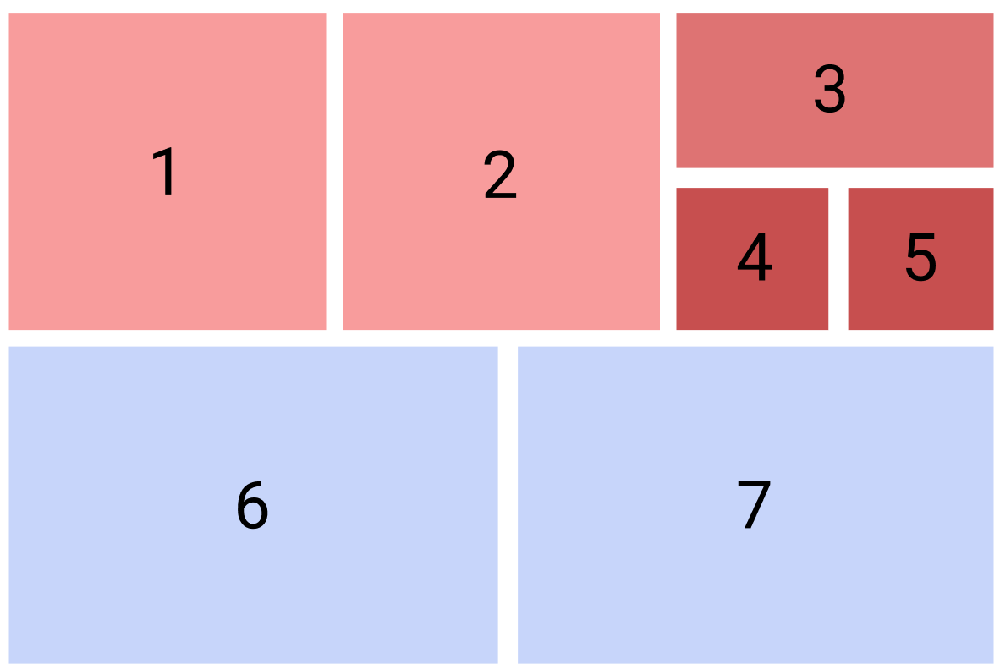

# Documentation 

This page details the different constructs and operations in our specification. The [Getting Started tutorial](getstarted.html) provides a gentler introduction for new users.

This documentation covers: 

* [Panels and Layouts](#panels-and-layout)
  * [Panels](#panels)   
  * [Comic Layout](#comic-layout)   
  * [Types of layouts](#types-of-layouts)
* [Data](#data)
  * [Classes](#classes)
  * [Variables](#variables)
* [Structure Operations](#operations)
  * [Highlight](#highlight)
  * [Append](#append)
  * [Remove](#remove)
  * [Load layout](#load-layout)
  * [Replace](#replace)
<!--  * [Lens](#lens) -->
<!--  * [Multilayer](#multilayer) -->
  * [Pan & Zoom](#pan--zoom)
  * [Jump](#jump)
* [Conditions](#conditions)
* [UI Elements](#ui-elements)
  * [Slider](#slider)
  * [Number Input](#number-input) 
  * [Isotype](#isotype) 

# Panels and Layout

## Panels
Comics are presented as a series of panenls. Panels can be `.svg` or `.png`. Panels are loaded within their specific array `panels`. Each panel has an `id` which must be some text e.g., `"panelWithBarChart"` or `"p1"`. This id will be used througout the specification to refer to this panel. The 'content' of each panel is loaded from a `url` pointing to a URL where the image is hosted. You can host your SVGs or PNGs on any server in the world as long as the image or svg is publicly retievable throug a URL.

#### Code example
```json
"panels":[
  {
      "id": "p1",
      "url":"mypanels/panel1.svg"
  },
  {
      "id": "panelWithBarChart",
      "url":"mypanels/panel2.svg"
   }
]
```

## Comic Layout
The comic layout is specified inside the  `layouts` array. You can specify alternative layouts which a user can load on demand using the **Load layout** operation. One layout needs to be set as the `currentLayout`.

Each layout needs a unique `name`. (*tip:* if you have several panels that are placed together and will be fixed forever (no interaction will dissassemble this panel group), you can export and manege these panels as 'one' panel (one single image).)

```json
{
"currentLayout": "myLayout",
"layouts": [
   {
      "name": "myLayout",
      "panels": [["p1","p2","p3"], ["p4","p5","p6"]]
   }
]
}
```
        
        
This exmple will load six panels, three in each row. 

## Types of layouts

A layout is modeled as a nested array, e.g., `[["p1","p2",["p3",["p4","p5"]]], ["p6","p7"]]` with the first two levels being mandatory. This layout spec will create the following layout:



* The first array contains all panels. It is always there. 
* The second level, e.g., `["p1","p2",["p3",["p4","p5"]]]` (red) and `["p6","p7"]` (blue), groups panels into rows. Each array is a new row.
* the third level, e.g., `["p3",["p4","p5"]]` (darker red) in our example, puts two panels, the first above the other within the same row.
* The fifth level, e.g., `["p4","p5"]` (darkest red) will place the two panels again side-by-side. "

**Note:** The with of panels depends on the SVG or PNG files. All the engine does is appending these panels and placing them in the layout. When you create your design, you should design a layout and panel sizes that work! 


# Data

Our spec has some constructs to refer to data, as it is intended for the construction of [Data Comics](https://www.datacomics.net/).

## Classes
Classes group visual elements within your elements into groups. Classes can be used to, e.g., highlight elements or otherwise refer to groups of elements. 

Classes are only possible in `svg` panels and requires the elements you are referring to to have unique IDs, `id="myBar"` in the `svg` file. IDs can be the same across panels, e.g., if you have several panels with a bar chart, the first bar can always be called, e.g., `bar1`.

The following example groups three elements `france`, `germany`, `uk` under the class `countries`. Note that these classes work like classes in CSS, but any class attributes in your `svg` are ignored. 

```json
"classes":[
  {
     "class": "countries",
     "elements":["france", "germany", "uk"]
  }
]
```

## Variables 
Variables store numerical values. Variable values can be shown inside text through a place holder that has the same id to the variable, or used to render a number of ISOTYPE like symbols. Variables can be obatained from data, or through user input, e.g., using a slider (see below). 

The optional `value` field specifies the default value if the variable is not set. 
You can create calculated variables by functions, expressed though `what`. 

The following example specifies variables with a default value. Two variables are based on functions. 

```json
"variables":[
  {
   "name": "movementSpeed",
   "value": 0
  },
  {
   "name": "movementVelocity",
   "value": 0
  },
  {
   "name": "totalMovement",
   "value": 0,
   "what": [
    "(",
    "movementSpeed",
    "+",
    "movementVelocity",
    ")"
   ]
  },
  {
   "name": "totalkm",
   "value": 0,
   "what": [
    "movementSpeed",
    "*2000",
    "+",
    "movementVelocity",
    "*8000"
   ]
  }
]
```

# Operations

Operations are the core of interactive data comics. Operations specify what should happen how.

### Highlight

The highlight operation can highlight content (e.g., panels or elements) upon a `trigger`; `click` or `mouseover` of a specified `element`. The highlight operations then highlights either: 
* all elements with the same ID as the `element` if `what` has not been informed
* or all element with the ID informed in the `what` field

Highlighting can be used as a visual reference when the authors wants the audience to look back/forward at a certain panel or show that an element is the same across panel. For providing clear affordances, it can also be used as a visual feedback or feedforward for interactive elements, e.g., indicating clickable elements or change an element's visual status after being clicked. 

The highlight operation can change the style of the element(s) or class(es) with given ID. How an element is highlighted can be defined through attrbutes `scale` (scales an element up (`scale` > 1) or down ( `scale` < 1), `border` or `color`. 

The following example highlights all elements (across all panels) with the ID `france` on mouseover one of these elements. The highlight causes these elemnts to become red (`"fill": "red"`) and scaled up by 50% (`"transform": "scale(1.5)"`). 

```json
{		
     "trigger": "mouseover", 
     "element": "france",
     "operation": "highlight", 
     "what": "france-details",
     "after": {"style": {"fill": "red", "transform": "scale(1.5)"}, "attr":[]},
}
```

### Append
This operation appends (inserts) one or more panels or a layout (`newpanels`) after given panel (`after`). The append operation is triggered through a `trigger` on an `element` (panel or element ID).

`newpanels` can contain 
* a single panel: e.g, `["p3"]`, 
* a layout specified in-place, e.g., `["p3",["p4","p5"]]`, or
* a reference to layout specified in the `layouts` array: e.g., `myLayout`. 

This operation can be used for different narrative purposes, e.g., adding a branch to the storyline from a certain point; providing more details by drilling down from this panel; revealing the answer for a question raised in the panel; hiding a punchline and etc. Note this operation will not romove or replace any panels. If you want remove any panle and load new panels, use "Load layout".

The following example appends a panel `"p11"` after panel `"p7"` by a click on panel `"p6"`.

```json
{
   "trigger": "click",
   "element": "p6",
   "operation": "append",
   "after": "p7",
   "newpanels": ["p11"]
}
```

### Load layout

This operation loads a layout from the `layout` array and removes anything else  panel specified by `after`. The operation is invoked by a `trigger` onto `element` (a panel or an element ID). 

This operation can be used similar to a menu on a website. For example, the designer can lead the audience to different versions (e.g., length, style or content) of the comic story by using a global navigation menu on the top of the comic.

The following example loads a new set of panels when clicking onto panel `"p5"`. 

```json
{
   "trigger": "click",
   "operation": "loadLayout",
   "element": "p5",
   "layout": [["p1","p2"], ["p3","p4"]],
   "after": "p7",
   "group": "group1"
}
```


<div>
          <iframe id="InteractiveComics"
            title="InteractiveComics"
            width="600"
            height="400"
            src='https://hugoromat.github.io/interactiveComics/library/dist/index.html?JSON=XQAAAAJmBQAAAAAAAABDKYjnU9ifL_Rot8OiRrk6xhmLiQgEyounlKIvn-fRcgmrBnRHJHX7c4pvm6VjS9D8A9EW1NYT2BHkXlcTudwpTHHA2uN8UdMlj8KXBvnfJQJGvNf4RhNzhCdS2UbCDZn7A-fFRMbgHFXVNbi_Cj7lO8JphQD8VQmN3a4HlnVkoF_rPN4IoxBithUSOrRpXf6jCQywgQLmuiX6pnOFw17MFd4aqi9N6xesV1WHclfmwZiK5H8Taq6B9VB2C82K2fvKaOYrPHtje3mIH_rCQYv5PR4p8pThF-FQQVLtPy_FDVdhSOAEG_O8VzEia4b4Gq2u-HElLDy4X48GuqLNa087O_llcqXJaDNqW21brHtsNx1NrlGGaF6A6r8XjblbUePJb54p-VAzGd1E6JPGMmBsWWRvOkSk41-9iRKgTOYPJsSdyGkowRxNwXcbPMS5xE9C93DCpgn4BU8kyfvcneA&coding=false'>
          </iframe>   
</div>


### Remove
This operation will remove panels `what` after doing ``"click"`` or ``"mouseover"`` on the ``"element"``. In the example below, when ``"sub3"`` will be clicked ``"sub1"`` and ``"sub2"`` will be removed.

```json
{
   "trigger": "click", 
   "element": "sub3",
   "operation": "remove",
   "what": ["sub1", "sub2"], 
}
```


<div>
          <iframe id="InteractiveComics"
            title="InteractiveComics"
            width="600"
            height="400"
            src='https://hugoromat.github.io/interactiveComics/library/dist/index.html?JSON=XQAAAALSAQAAAAAAAABEKchmwyq5QbBWQDrInpDsHdvV1x20B3E-SjTJR9hgq6uxBgC4684nIChPe-hteZOM7IIOcKviOpEd-Jju75AO6_uJ0JV94cTO-rRi-rqUVfPxzynH-7eL76wTDWWxZtLRK3FYbwyP6KJ3X7Pd5CUNveAXW4O_wETyWA9qqT4UkUhEi5Pjvf5wf_gM0yvJse1IyK-zG6zxPngWbOlp8_bNzZ_RRnkyw-xa0fN41VjJsQofHAO7VwEtKShfpvitaj-bNg7PmpNarljxNms8OH9HAEAo4fqUX__uLuIc&coding=false'>
          </iframe>
        </div>

### Replace 


This operation will replace a panel with `newpanels` after doing ``"click"`` or ``"mouseover"`` on the ``"element"``. In the example below, ``"p12"`` indicates the panel with the ``"id"`` of ``"p12"``.
```json
{
   "trigger": "click",
   "element": "p4",
   "operation": "replace",
   "replace": "p4",
   "newpanels": [
    "p12",
    "p15"
   ]
  }
```

<!--
### Lens
This operation creates a 'lens' (or viewport) within one panel (`element`), while a 2nd panel (`linked`) shows the content of the lens in larger detail. A user can move the lens through drag and drop. `viewport-size` indicates the size of the viewport relative to the panel in which the viewport sits.

<p style="background-color:tomato;">which panel is which here? why is linked an array?</p>

```json
{
   "operation": "lens", 
   "trigger": "mouseover",
   "element": "p14",
   "linked": ["p15"], 
   "viewport-size": "20%
}
```

### Multilayer

<p style="background-color:tomato;">clarify</p>

```json
{
   "operation": "multilayer", 
   "trigger": "click",
   'element': "14",
   'elements':[{
       'id': 1, 'linked':[2,3]}]
}
```
-->

### Pan & Zoom 
Creates a simple pan and zoom behavior for a dedicated panel. Can also propagate that zoom to another panel (`linked`). 

```json
{
   "operation": "zoom", 
   "trigger": "zoom",
   "element": "p2",
   "linked": ["groupToDrag"]
}
```

### Jump
Jump to another view in the canvas
```json
{
   "trigger": "click",
   "operation": "jump",
   "element": "down",
   "target": "p2"
 }
```
<div>
          <iframe id="InteractiveComics"
            title="InteractiveComics"
            width="600"
            height="400"
            src='https://hugoromat.github.io/interactiveComics/library/dist/index.html?JSON=XQAAAALlAAAAAAAAAABDqYjnU9ifL9xKRDsbehVNMYoOrxdTQ7hMkTJVwFaRhRsuMqTTihbZkiR42GI4v_jakB-SEphE8vp3nOl5DWR7Fxd7bqrYoFXcWbqVl-M1zQQjhaK17w8ujHDNqXS3u4UPpkni9RNYpTSfjO7A0E0uONMiHrYdXDVNlGtdwAMjEMPJsY3mQB7CyCPNgwigDn478b7eQ5cK1ymOiGJwFAvVyIictlb7gQO_EUiXf__14dMA&coding=false'>
          </iframe>
</div>


# Conditions

Setting a condition for operations, when the operation is triggered, different operations will run under the condition set.

```json
{ 
    "trigger": "click",    
    "condition": ["totalC02", "> 10"],
    "operation": "loadlayout"
}
```
```json
{   
    "condition": ["totalC02", "> 10"],
    "operation": "append"
}
```


# UI Elements

UI elements can be 'injected' into SVG panels (not possible with PNG), replacing an element with a specific ID. Values of UI elements can be mapped to [variables](#variables). 

UI elements are specified *inside* a panel spec.


### Slider

A slider can be created for an element with a specific `id` and bound to a `variable`. The length of the slider will be as same as the placehover element. `min` and `max` are optional attribute indicating minimum and maximum value of the slider and its associated variable. Default values of min and max are `0` and `100 ` respectively.

The below example creates two sliders inside the panel spec for panel `0`. Each slider is bound to a variable.

```json
"panels": [
  {
    "id": "p1",
    "url": "/CO2Footprint/inputPanel.svg",
    "sliders": [
      {
        "id": "slider_movementSpeed",
        "variable": "movementSpeed",
        "min": 100,
        "max": 200
      },
      {
        "id": "slider_movementVelocity",
        "variable": "movementVelocity"
      }
    ]
  } 
]
```

### Number Input

```json
"panels": [
  {
    "id": "p1",
    "url": "/CO2Footprint/inputPanel.svg",
    "input": [
      {
         "id": "slider_movementSpeed",
         "variable": "movementSpeed"
      },
      {
         "id": "slider_movementVelocity",
         "variable": "movementVelocity"
      }
     ]
  } 
]
```

### Isotype

This UI element creates one ore more [ISOTYPE](https://en.wikipedia.org/wiki/Isotype_(picture_language)) like pictograms inside an element (`TreesPlaceHolder`) and binds the number of icons to the value of the `variable`.  The size of each icon can be adjusted in `widthIcon`. The icon is loaded from the `svg` specified by `url`.

```json
{
   "operation": "isotype",
   "variable": "treeIcon",
   "to": "TreesPlaceHolder",
   "attr": {
    "widthIcon": 4.5
   },
   "icon": "images/CO2Footprint/treeIcon.svg"
}
```


