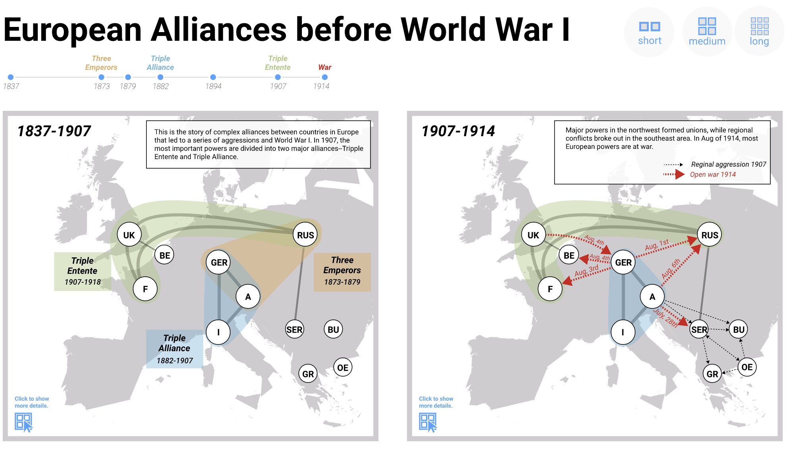
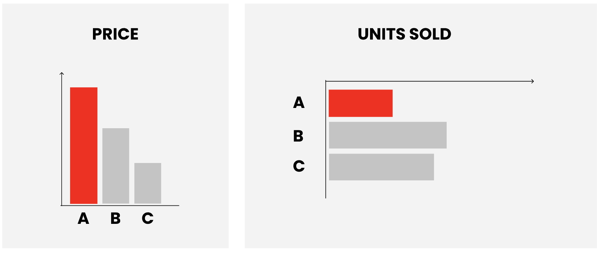

# Examples

* [JSON Script](https://raw.githubusercontent.com/interactivedatacomics/interactivedatacomics.github.io/main/comics/alliances/alliances-1.json)
* [Live Editor](https://hugoromat.github.io/interactiveComics/library/dist/alliances.html)

## Personal C02 Emissions

* [JSON Script](https://raw.githubusercontent.com/HugoRomat/interactiveComics/master/library/dist/images/CO2Footprint/CO2.json)
* [Live Editor](https://raw.githubusercontent.com/HugoRomat/interactiveComics/master/library/dist/index.html)

## Simple Bar Chart Example

* [JSON Script](https://raw.githubusercontent.com/interactivedatacomics/interactivedatacomics.github.io/main/getstarted/tutorial.json)
* [Live Editor](https://raw.githubusercontent.com/HugoRomat/interactiveComics/master/library/dist/getStarted.html)
