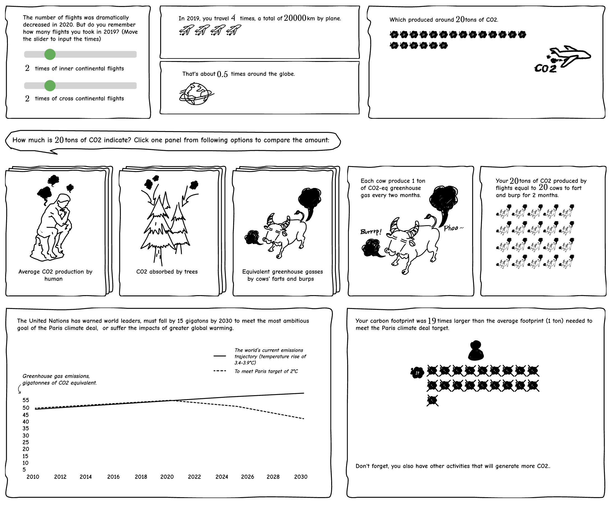
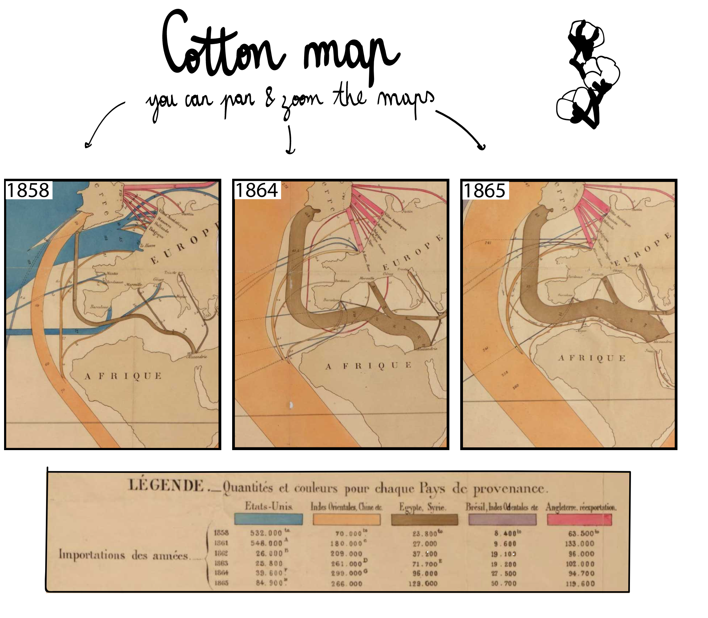
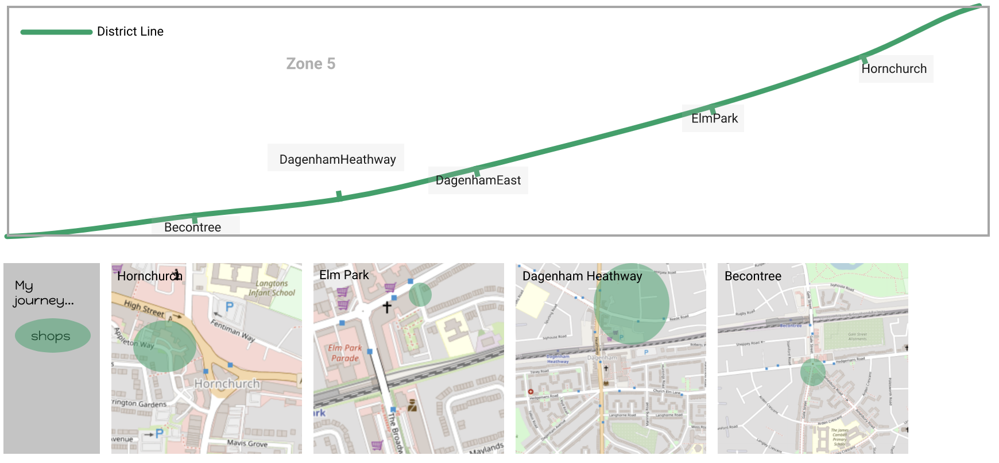

# Examples

(If you find an example on this page broken, please [email us](zehong.wang@ed.ac.uk) so we can fix it. Our system is still a prototype and constantly improving).

* [JSON Script](https://raw.githubusercontent.com/interactivedatacomics/interactivedatacomics.github.io/main/comics/alliances/alliances-1.json)
* [Live example in editor](https://hugoromat.github.io/interactiveComics/library/dist/alliances.html)

## Personal CO2 Emissions

* [JSON Script](https://raw.githubusercontent.com/HugoRomat/interactiveComics/master/library/dist/images/CO2Footprint/CO2.json)
* [Live example in editor](https://hugoromat.github.io/interactiveComics/library/dist/C02.html)

## Drag-Zoom Example

* [JSON Script](https://raw.githubusercontent.com/interactivedatacomics/interactivedatacomics.github.io/main/getstarted/map.json)
* [Live example in editor](https://hugoromat.github.io/interactiveComics/library/dist/map.html)

## Simple Bar Chart Example

* [JSON Script](https://raw.githubusercontent.com/interactivedatacomics/interactivedatacomics.github.io/main/getstarted/tutorial.json)
* [Live example in editor](https://hugoromat.github.io/interactiveComics/library/dist/getStarted.html)

## A tube journey in East London

* [JSON Script](https://raw.githubusercontent.com/interactivedatacomics/interactivedatacomics.github.io/main/comics/EaternLondon/EasternLondon)
* [Live example in editor](https://hugoromat.github.io/interactiveComics/library/dist/london.html)

## Explore Jack's body
_Created by Josh Holinaty_

[(CC BY-NC-ND)](https://creativecommons.org/licenses/by-nc-nd/4.0/)

* [JSON Script](https://raw.githubusercontent.com/oseph/interactive-data-comics-assets/main/jhcomic.json)
* [Live example in editor](https://hugoromat.github.io/interactiveComics/library/dist/dogJack.html)
