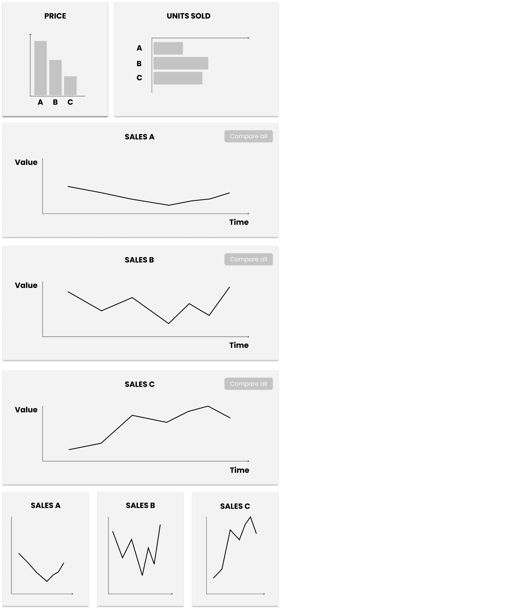
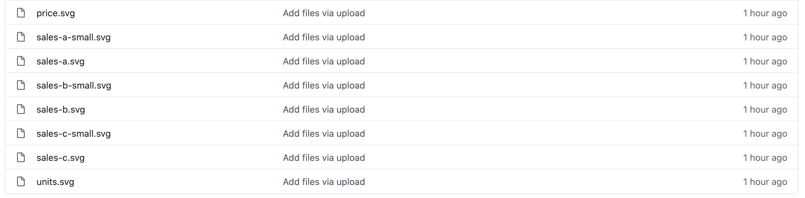
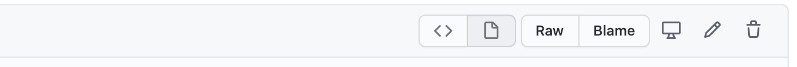

# Get Started

Using a simple example, this page gives a step-by-step overview of how you can create an interactive data comic using proprietary drawing tools and our [scripting language](documentation.html). In this example, we will create a simple comic that 
* starts with 2 panels, 
* highlights elements, and 
* adds more panels on click. 

Check the [final interactive comic in our editor](https://hugoromat.github.io/interactiveComics/library/dist/getStarted.html). You can download the [JSON specification for this example here](getstarted/tutorial.json). After this tutorial, read the [documentation](documentation.html) to learn about the other operations.

The scripting language is written in [Java Script Object Notation (JSON)](https://en.wikipedia.org/wiki/JSON) and is used to specify layouts and interactions on top of a set of drawn comic panels. **We strongly recommend you to check your JSON script using a common JSON validator, such as [JSONlint](https://jsonlint.com) to avoid syntax errors**.

The steps to create an interactive data comic are as follows, explained in detail in this tutorial: 
* [1 Creating Panels](#creating-panels): drawing panels and layout, naming elements in panels and export individual panels. **This step will take most of your time** and does not involve our specification.
* [Export panels and host them online](#13-exporting-panels)
* [2 Specify layout](#specify-layout): specify how panels will be laid out in the interactive version.
* [3 Specify operations](#specify-operations): specify what interactive features you would like the comic to have.


# 1 Creating Panels

Panels are the core element of any (interactive)(data) comic and you will spend a significant amount of time drawing your comic. 

## 1.1 Drawing Panels

Panels are created using any drawing tool you like and are completely created by you and your creativity. Panels can contain text, images, drawings, and visualizations.  

Generally, we distinguish between the following two *panel formats*:

* **Vector graphics:** which can export to the scalable vector graphic (`.svg`) format. Commonly used tools include Adobe Illustrator, [Figma](https://www.figma.com) (which is free to use), Sketch, etc. **We strongly recommend that you create your panels as a vector graphic**.
* **Pixel graphics:** export into common `.png` files. The most prominent example tool is Adobe Photoshop, etc. You can also draw panels by hand, scan them, and save them as `.png` files. 


**Note:** Creating panels as '.svg' allows for more interactivity than `.png` files because we can describe elements inside the panels and reuse them for interactivity. Alternatively, you can, e.g., hand-draw your panels, then import them into Adobe to add more specific elements (see below).

For our example comic we have drawn the following 8 panels in Figma as vector graphics. We must draw each panel that we want to show at any point in our comic. In the final comic, we start by showing only the first 2 panels and show one more panel on demand. 

When we draw the panels, we should draw them with a specific layout in mind. For example, we can draw the panels in their final layout in Figma. In the below image, we show all 8 panels that a user can eventually see in this example since we created them in the same file. 



## 1.2 Name elements in SVG panels

To make elements (parts of visualizations, text, buttons, etc.) *inside* our panels interactive, we give those elements IDs. IDs will appear as `id` in the SVG file. To create IDs in Figma, simply change the name of an object in the item list on the left. Alternatively, you can open the exported SVG file using any text editor and add the ID attribute as in the example above. 

In our example, we label the three bars in each chart/panel as well as as the lines in the line charts with the IDs `a`, `b`, and `c` respectively since they all correspond to the same data elements labeled A, B, and C. We should label the same element in our comic **always** with the same ID as this allows to, e.g., highlight all occurrences of this element later. 

We also want our 'compare all' button to show some more panels when clicked. To that end, we give all three instances of this button the same ID `compare `. 

## 1.3 Exporting Panels

We can now export each panel into its own file, either `.png` or `.svg`. In Figma, we do this by:

* for each panel individually:
* select all elements in that panel, including the panel frame or background,
* group these elements ('right-click > Group Selection' or `command+G` on Mac),
* Select the small "`+`" sign beside `Export` in the menu on the right
* Change `PNG` to `SVG`
* Click the "`...`" button to the right of the "SVG" field 
* Make sure the *"Include 'id' Attribute"* option is checked. 
* Click the `Export ...` button. 

In illustrator: 
* save As an svg file, carry on as normal until you get the final dialogue window. Once this pops up, 
* click on more options in the bottom left, 
* uncheck Responsive

We repeat this for **each** panel. In our case, we end up with eight SVG files, which we will name like so (the following order is the order in which these panels appear in the figure above):
* `price.svg`
* `units.svg`
* `sales-a.svg`
* `sales-b.svg`
* `sales-c.svg`
* `sales-a-small.svg`
* `sales-b-small.svg`
* `sales-c-small.svg`

## 1.4 Make Panels Available Online

Next, we need to store all panels on a public web space for our software to find them. If you do not have your own server, create a public and free [GitHub](https://github.com) repository. Then, upload all your panels, which should look like so: 



To get the public URL for each panel, click on each file and click the `Raw` button in the menu bar just above the panel image: 



On the new page that opens, copy the URL from your browser window. That is your panel's URL. In our case, we obtained the following URLs. You can use these URLs for the rest of the tutorial, you do not have to upload these panels again. 

* [https://raw.githubusercontent.com/interactivedatacomics/interactivedatacomics.github.io/main/getstarted/panels/price.svg](https://raw.githubusercontent.com/interactivedatacomics/interactivedatacomics.github.io/main/getstarted/panels/price.svg)
* [https://raw.githubusercontent.com/interactivedatacomics/interactivedatacomics.github.io/main/getstarted/panels/units.svg](https://raw.githubusercontent.com/interactivedatacomics/interactivedatacomics.github.io/main/getstarted/panels/units.svg)
* [https://raw.githubusercontent.com/interactivedatacomics/interactivedatacomics.github.io/main/getstarted/panels/sales-a.svg](https://raw.githubusercontent.com/interactivedatacomics/interactivedatacomics.github.io/main/getstarted/panels/sales-a.svg)
* and to forth. 


Voila, we can now move the scripting language. 

# 2 Specify Layout

The specification is written in [Java Script Object Notation (JSON)](https://en.wikipedia.org/wiki/JSON). You do not have to be familiar with JSON as our specification is quite simple. From here on, you can simply copy-paste our examples and modify them on your own. 

If you have never heard of JSON before, check this brief [introduction](json-intro.html).

All of the following code of this tutorial should be surrounded by a pair of curly brackets "`{}`".

## 2.1 Specify Panels 

First, we load our panels. This happens by specifying the URL and a panel ID for each panel, inside a `panels` array. Effectively, each panel is an object with two attributes (key-value pairs): `id` and `url`.

```json
"panels": [
  {
   "id": "p_price",
   "url": "https://raw.githubusercontent.com/interactivedatacomics/interactivedatacomics.github.io/main/getstarted/panels/price.svg"
  },
  {
   "id": "p_units",
   "url": "https://raw.githubusercontent.com/interactivedatacomics/interactivedatacomics.github.io/main/getstarted/panels/units.svg"
  },
  {
   "id": "p_sales-a",
   "url": "https://raw.githubusercontent.com/interactivedatacomics/interactivedatacomics.github.io/main/getstarted/panels/sales-a.svg"
  },
  {
   "id": "p_sales-b",
   "url": "https://raw.githubusercontent.com/interactivedatacomics/interactivedatacomics.github.io/main/getstarted/panels/sales-b.svg"
  },
  {
   "id": "p_sales-c",
   "url": "https://raw.githubusercontent.com/interactivedatacomics/interactivedatacomics.github.io/main/getstarted/panels/sales-c.svg"
  },
  {
   "id": "p_sales-a-small",
   "url": "https://raw.githubusercontent.com/interactivedatacomics/interactivedatacomics.github.io/main/getstarted/panels/sales-a-small.svg"
  },
  {
   "id": "p_sales-b-small",
   "url": "https://raw.githubusercontent.com/interactivedatacomics/interactivedatacomics.github.io/main/getstarted/panels/sales-b-small.svg"
  },
  {
   "id": "p_sales-c-small",
   "url": "https://raw.githubusercontent.com/interactivedatacomics/interactivedatacomics.github.io/main/getstarted/panels/sales-c-small.svg"
  }
 ]
```

Our engine will retrieve the pictures from these URLs.

## 2.2 Specify Panels 

Second, we need to specify how panels are laid out. The layout design should have happened in the [design phase](#11-drawing-panels).
The panel width for each panel is specified inside each panel SVG or PNG file so that you do not have to care about this in the specification. All we need to do is to specify the order and when to start a new row. 

Layouts are specified as *nested* arrays using squared brackets `[]`. For our example, we create a layout with 1 row that contains our first two panels `p_price` and `p_units`. To that end, we place both numbers into an array `["p_price","p_units"]` to indicate that they should appear on the *same* row (our specification supports a [wide range of layout options](documentation.html#comic-layout)).

Now, we give the layout a `name` and add it to a `layouts` array (give the layout any name you like, here we call it `myLayout`). We move our panel specification from above (`[1,2]`) into the array of the `"panels"` attribute. The outer array allows us to add more rows later but here, we start with only one row.

```json
"layouts": [
  {
   "name": "init",
   "panels": [["p_price","p_units"]]
  }
]
```

The `layout` array allows you to add multiple layouts and [switch between the layouts interactively](documentation.html#load-layout). 

Lastly, we need to indicate the layout we want to start with: 

```json
"currentLayout": "init"
```

At this point, we can run [our code](gestarted/tutorial-layoutonly.json), missing only the interactions.


# 3 Specify Operations

Now, we can specify operations to make our comic interactive. Any operation is a JSON object in the `operations` array: 

```json
"operations":[]
```
In the following, we specify two types of operations.

## Highlight elements on mouse-over

The first operation highlights (`"operation": "highlight"`) all occurances of element `A` when the user hovers (`"trigger": "mouseover"`) any element with the id `a` (`"element": "a"`). The highlighted elements will be drawn with a red content and red border (`"after": {"style": {"fill": "red", "border": "red"}}"`). We create (e.g., copy-paste) the same operation three times, once for each of the elements `a`, `b`, and `c`.
 
```json
"operations": [
  {
   "trigger": "mouseover",
   "element": "a",
   "operation": "highlight",
   "after": {
    "style": {
     "fill": "red",
     "stroke": "red"
    }
   }
  },
  {
   "trigger": "mouseover",
   "element": "b",
   "operation": "highlight",
   "after": {
    "style": {
     "fill": "blue",
     "stroke": "blue"
    }
   }
  },
  {
   "trigger": "mouseover",
   "element": "c",
   "operation": "highlight",
   "after": {
    "style": {
     "fill": "orange",
     "stroke": "orange"
    }
   }
  }
]
```

Running the code, you can now hover over each of the three bars and will see the corresponding bars in the other panel showing up in the same color.

## Show new panels on click

The second operation loads new panels (`"operation": "loadLayout"`) below after panel 2 (`"after": 2`) when the user clicks (`"trigger": "click"`) on any element 
with the id `a` (`"element": "a"`). The new panel is shown in a new row  (`"newpanels": [[3]]`). The first pair of `[]` in `[[3]]` is the array containing all new panels, while the inner pair of brackets says that the inside mentioned panels are shown on a new row. If you indicate only `[3]`, the new panel will be shown on the same row as panels 1 and 2. Try it out!

As above, we create the same operation 3 times, once for each of the elements A, B, and C in the bar charts. This time, we need to load a different panel for each element: 
* panel `"p_sales-a"` for elemnt `a`,
* panel `"p_sales-b"` for elemnt `b`,
* panel `"p_sales-c"` for elemnt `c`.

The statement `"group": "group1"`, which we attach to each `loadLayout` operation indicates that only one of the operations in `group1` can be shown. In other words, if panel `p_sales-a` is shown and the user clicks element `b`, panel `p_sales-a` will be replaced with panel `p_sales-b`. If you remove `"group": "group1"`, panel `p_sales-b` would be inserted just after panel `2` but before panel `p_sales-a`. 

Copy the following code into the `operation` array. Make sure each operation is separated by a comma `,` before the opening bracket `{` of that operation. 

```json
 {
   "trigger": "click",
   "element": "a",
   "operation": "loadLayout",
   "after": "p_units",
   "group": "group1",
   "layout": [["p_sales-a"]]
  },
  {
   "trigger": "click",
   "element": "b",
   "operation": "loadLayout",
   "after": "p_units",
   "group": "group1",
   "layout": [["p_sales-b"]]
  },
  {
   "trigger": "click",
   "element": "c",
   "operation": "loadLayout",
   "after": "p_units",
   "group": "group1",
   "layout": [["p_sales-c"]]
  }
```

Last, we want a click onto the button *compare* to replace the current detailed set of panels (`p_sales-a`,`p_sales-b` or `p_sales-c`) with a series of smaller panels showing all three time series at the same time. The following code creates another operation `loadLayout` that is triggered when the user clicks (`"trigger": "click"`) the 'Compare All' button (`"element": "compare"`, remember, we gave the 'Compare All' button the id `compare`. Without that ID, the code will not work).

Note that in this example, we replace the current panel in layout group `group1` by three panels on a new row: `[["p_sales-a-small","p_sales-b-small","p_sales-c-small"]]`.  
```json
{
   "trigger": "click",
   "element": "compare",
   "operation": "loadLayout",
   "group": "group1",
   "after": "p_units",
   "layout": [["p_sales-a-small","p_sales-b-small","p_sales-c-small"]]
}
```

Again, check the [final interactive comic in our editor](https://hugoromat.github.io/interactiveComics/library/dist/getStarted.html). You can download the [JSON specification for this example here](getstarted/tutorial.json). Read the [documentation](documentation.html) to learn about the other operations.
