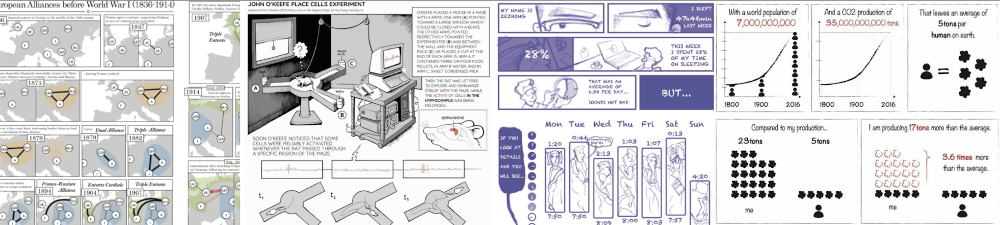

# Interactive Data Comics

 
<html>
<body>

<iframe width="560" height="315" src="https://www.youtube.com/embed/9u1tg2gHNAc" frameborder="0" allow="accelerometer; autoplay; clipboard-write; encrypted-media; gyroscope; picture-in-picture" allowfullscreen></iframe>

</body>
</html>

[Data comics](https://datacomics.github.io) are a way of effectively communicating with data through data visualizations. They are inspired by the visual language of comics. This project adds interactivity to data comics to **support exploration, explanation, and engagement**. 

Interactions are specified using a [JSON](https://en.wikipedia.org/wiki/JSON) specification and which can be rendered using our [online editor](). 

Interactions include: 
* Highlight
* Append
* Load layout
* Replace
* Lens
* Pan & Zoom
* Pictograms
* and UI elements such as sliders and text input.

Check our [examples](examples.html), attend our [tutorial](tutorial.html), [get started](getstarted.html) with your own interactive data comic, or check our [documentation](documentation.html) of all available interactive techniques.

If you have questions or suggestions, [get in touch](about.html).
