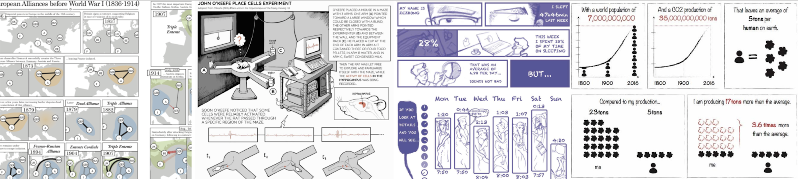

# Tutorial

<iframe width="560" height="350" src="https://www.youtube.com/embed/YGLoBrMgoIE" frameborder="0" allow="accelerometer; autoplay; clipboard-write; encrypted-media; gyroscope; picture-in-picture" allowfullscreen></iframe>

We seek anyone interested in creating interactive web [data-comics](http://interactivedatacomics.github.io) to join our tutorial: learn how to create interactive comics with our **scripting editor** and give us feedback to improve it. The 30min live tutorial will be held on March 15, 5pm UK time (a video recording will be made available) to get you started, and then you will be working on your comics by yourself, at your own pace. We will be available for questions and help and to gather feedback until March 26, 2021.

No programming knowledge is required but experience with JSON/JavaScript as well as tools such as Adobe Illustrator, Figma. Photoshop,or Paint is an asset but not required. Or, draw your visuals by hand on paper! 

All you need to participate is **eagerness to tell a story** in a visual, compelling, novel, and interactive fashion! **Ideally, come with a dataset and story idea** in mind. And **willingness to share your feedback** on the language, editor and creation process (e.g. what is difficult? what is easy?). We would also like to feature your data comics creations—with your permission—for our research.  This research is not for profit, and it obtained approval  from the ethics board of the School of Informatics, University of Edinburgh. Participation does not require consent but we will not collect and data from you without your consent (see below).

In the tutorial, we will help you learn: 

* What are (interactive) data comics
* How to create and export individual comic panels for your own story
* How to add interactions to the comics using our novel light-weight scripting language.  

The tutorial has four components, helping you to create your interactive comics at your own pace and with our help:

* A **live introduction and overview**: _Monday, March 15, 2021_. 5pm UK time. Duration: ~30min. Gives an overview over our research, interactive data comics, and the editor. This session will be recorded if you cannot make that time. Link to join: [https://eu.bbcollab.com/guest/b5b93ab7150740379049bb3ac778ca24](https://eu.bbcollab.com/guest/b5b93ab7150740379049bb3ac778ca24).
* **Web tutorials** are available [on our website](http://interactivedatacomics.github.io), self-administered with examples and full documentation. New tutorials and examples will be added.
* **Face-to-face drop-in sessions** to help you create your own comic and discuss any questions. March 16-26, daily 1-2pm and 5-6pm UK time. 
* **Individual appointments:** limited number of slots available, upon email-request if the Q&A sessions do now work for you. 

[Sign-up](https://forms.office.com/Pages/ResponsePage.aspx?id=sAafLmkWiUWHiRCgaTTcYT454c7pHApDjrGpFCScNM9UMzVaUERaSjA1VjcwSlpENEdKUlNBMEo0Ti4u) for the tutorial is anonymous but you can submit your email if you would like to obtain updates on the tutorial and our activities. 

# Details

## What is this tutorial about?
The tutorial is part of our ongoing research on data comics and we are interested in improving our current interactions and authoring environment. The tutorial might be of use to you if you are planning to illustrate results from your research, want to tell personal stories with data, or engage a wider audience with data and visualizations.

Data comics are a powerful means to communicate data with visualizations, inspired by the familiarity and graphical language of comics ([http://datacomics.github.io](http://datacomics.github.io)). As part of our ongoing research project at the University of Edinburgh, we are now designing interactive means to enhance understandability of and engagement with data comics. You can find examples of interactive data comics [on our website](https://interactivedatacomics.github.io). (more examples will follow in the next days).

To solicit feedback on our research and help you build interactive data comics, we run a tutorial with consultation sessions over the next weeks. Our tutorial will cover the different types of interactions and help you scripting your own interactive data comic using a simple scripting language.

## Who is eligible?
While the tutorial is open to anyone with an interest in data-driven storytelling and data visualization, most benefits will be to those with a story or even some existing visualizations that they would like to turn into an interactive comic.

## What to expect?
The tutorial is split into several parts to accommodate for your personal schedule: 

### Live Introduction and Overview (Monday, March 15th 2021, 5pm UK time. 30min)

Open to all. Feel free to join our intro session to see if interactive data comics are for you.
Please [register here](https://docs.google.com/forms/d/e/1FAIpQLSdR7YOI5Eoi-G5qsiXu1kDsLNS138lS8ubn21LAG4WKp5nGBw/viewform).

This live session gives an overview over our research in data comics and interactive data comics. It demonstrates examples of which interactions we currently support as well as the scripting language. The short session will be recorded and can then be found on our website. We conclude with a Q&A session (not recorded). 

Join us here: [https://eu.bbcollab.com/guest/b5b93ab7150740379049bb3ac778ca24](https://eu.bbcollab.com/guest/b5b93ab7150740379049bb3ac778ca24)

### Web tutorials

Our website ([https://interactivedatacomics.github.io](https://interactivedatacomics.github.io)) will feature tutorial material, including short videos and a complete documentation of our interactions and the scripting language. We will add new tutorials and examples over the coming days.

### Drop-in Q&A sessions

We would like to help you with your personal data comic through a set of Q&A sessions where you can bring your comic and discuss any issues you may have. If you cannot make these Q&As, please get in touch with us to book a specific appointment. 

While not required for participation, we would like to kindly ask for your permission and written consent to potentially use your anonymized comments, questions, feedback and eventually (parts of) your comic to include in publication and presentations about our research (names can be attributed if you wish). More information on the consent and information here: [Sign-up](https://forms.office.com/Pages/ResponsePage.aspx?id=sAafLmkWiUWHiRCgaTTcYT454c7pHApDjrGpFCScNM9UMzVaUERaSjA1VjcwSlpENEdKUlNBMEo0Ti4u). 

The link to our Q&A sessions is here: [https://eu.bbcollab.com/guest/b5b93ab7150740379049bb3ac778ca24](https://eu.bbcollab.com/guest/b5b93ab7150740379049bb3ac778ca24)

## What will you learn?
During the period of the tutorial, we will teach you how to create interactive web comics with visualizations. The tutorial features asynchronous learning with daily drop-in Q&A sessions. 

* **What are interactive comics**: this happens in the live session on Monday, March 16, 5pm. The session will be recorded. 
* **How to create the individual panels**: panels are created using vector graphic programs or other tools and need to be exported into SVG or PNG. 
* **How to create interaction using a simple scripting language**. Once you have created all your panels, you can use our simple scripting language to add interactivity such as: 
  * Highlight elements on mouse over
  * Append panels on clicking elements and panels
  * Load new layouts
  * Replace panels
  * Show and hide information
  * Pan & Zoom inside panels
  * Visualize data using simple pictograms
  * Add UI elements such as sliders and text input

We have a [Getting Started](https://interactivedatacomics.github.io/getstarted.html) tutorial that explains how to create a simple comic.

## What do we hope to learn? 

Our research focuses on improving the way we communicate data. This particular project seeks to investigate ways to make data comics interactive. To that end, we have created a simple scripting language and editor, allowing you to add interactivity on an existing set of comic panels and visualizations. The language is currently in a prototype state.

Through the tutorial we hope to learn: 
* What was difficult/easy for you?
* What was more/less time consuming?
* What was more/less useful?
* What type of data/stories you would like to share in this format?
* In your point of view, how do interactive data comics compare to paper/static comics?
* Which of these interactions do you think are going to help your audience the most?
* What are critical interactions you see missing from our editor?

These findings will inform our research on creating appropriate visual editors for data comics and potentially novel means for data-driven visual storytelling. You can find a list of publications here: [https://datacomics.github.io/publications.html](https://datacomics.github.io/publications.html).

